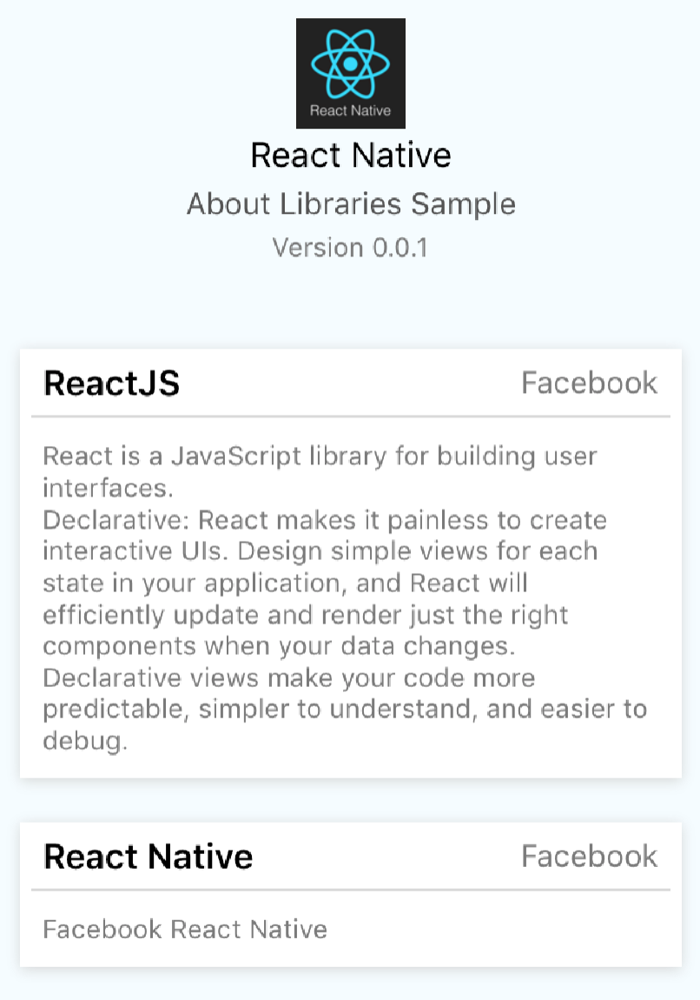

<p align="center"></p>

<p align="center">
  <a href="https://www.npmjs.com/package/react-native-about-libraries"></a>
  <a href="https://github.com/prscX/react-native-about-libraries/pulls"></a>
  <a href="https://github.com/prscX/react-native-about-libraries#License"></a>
</p>


# React Native About Libraries

The React Native About Libraries package is on a similar concept of [AboutLibraries](https://github.com/mikepenz/AboutLibraries). We would like to credit this library to all the [AboutLibraries](https://github.com/mikepenz/AboutLibraries) contributors

This package allows you to easily create an used open source libraries component within your app. As an extra feature you can also add an about this app section.

Here's a quick overview of functionalities supported:

* Listing of used open source libraries
* Provision for adding app section (optional)
* Autodetect installed packages
* Auto Font Scaling
* Much much more... try the sample for a quick overview.

## Getting started

`npm install react-native-about-libraries --save`

## Usage

```javascript
import { AboutLibraries } from 'react-native-about-libraries'

<AboutLibraries about={about} libraries={libraries} />


let about = {
  avatar: Avatar,
  name: 'React Native',
  description: 'About Libraries Sample',
  version: 'Version 0.0.1'
}

let libraries = [
  {
    name: 'ReactJS',
    description: `React is a JavaScript library for building user interfaces.`,
    creator: 'Facebook',
    license: 'MIT',
    version: '16.0.0',
    link: 'https://github.com/facebook/react'
  },
  {
    name: 'React Native',
    description: 'Facebook React Native',
    creator: 'Facebook',
    license: 'MIT',
    version: '0.52.0',
    link: 'https://github.com/facebook/react-native'
  }
]
```

## Props

| Prop              | Type       | Default | Note                                                                                                       |
| ----------------- | ---------- | ------- | ---------------------------------------------------------------------------------------------------------- |
| `about`           | `JSON`     |         | You can pass app info in order to render the app header. It's props are avatar, name, description, version |
| `libraries`       | `JSON`     |         | List of libraries you are using within your app                                                            |
| `renderAbout`     | `Function` |         | You can provide your own custom about section renderer                                                     |
| `renderLibraries` | `Function` |         | You can provide your own custom library section renderer                                                   |  |
| `libraryStyle`    | `JSON`     |         | You can customize library renderer style by pass your custom styles                                        |  |
| `aboutStyle`      | `JSON`     |         | You can customize about section renderer by providing about style                                          |

## TODO

* Autodetect installed packages
* Auto Font Scaling

## Contributing

Contributions are welcome and are greatly appreciated! Every little bit helps, and credit will always be given.

## License

React Native About Libraries is provided under the MIT License


## Other Contributions

| [awesome-react-native-native-modules](https://github.com/prscX/awesome-react-native-native-modules)              |
| ----------------- |
|                   |


| [react-native-spruce](https://github.com/prscX/react-native-spruce)              |
| ----------------- |
|                   |


| [react-native-taptargetview](https://github.com/prscX/react-native-taptargetview) & [react-native-material-showcase-ios](https://github.com/prscX/react-native-material-showcase-ios)              |
| ----------------- |
|   |


| [react-native-bottom-action-sheet](https://github.com/prscX/react-native-bottom-action-sheet)              |
| ----------------- |
|                   |


| [react-native-popover-menu](https://github.com/prscX/react-native-popover-menu)             |
| ----------------- |
|                   |


| [react-native-tooltips](https://github.com/prscX/react-native-tooltips)             |
| ----------------- |
|                   |


| [react-native-shine-button](https://github.com/prscX/react-native-shine-button)             |
| ----------------- |
|                   |


| [react-native-iconic](https://github.com/prscX/react-native-iconic)             |
| ----------------- |
|                   |


| [react-native-download-button](https://github.com/prscX/react-native-download-button)             |
| ----------------- |
|                   |


| [react-native-siri-wave-view](https://github.com/prscX/react-native-siri-wave-view)             |
| ----------------- |
|                   |


|  [react-native-material-shadows](https://github.com/prscX/react-native-material-shadows)             |
| ----------------- |
|                   |


|  [react-native-gradient-blur-view](https://github.com/prscX/react-native-gradient-blur-view)             |
| ----------------- |
|                   |


|  [vs-essential-plugins](https://github.com/prscX/vs-essential-plugins)             |
| ----------------- |
|                   |


|  [prettier-pack](https://github.com/prscX/prettier-pack)             |
| ----------------- |
|                   |
